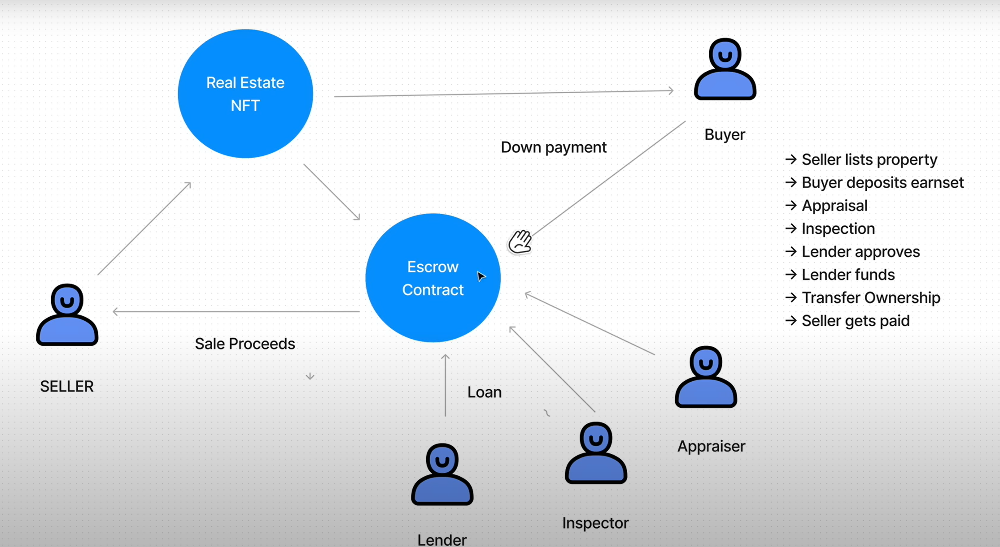
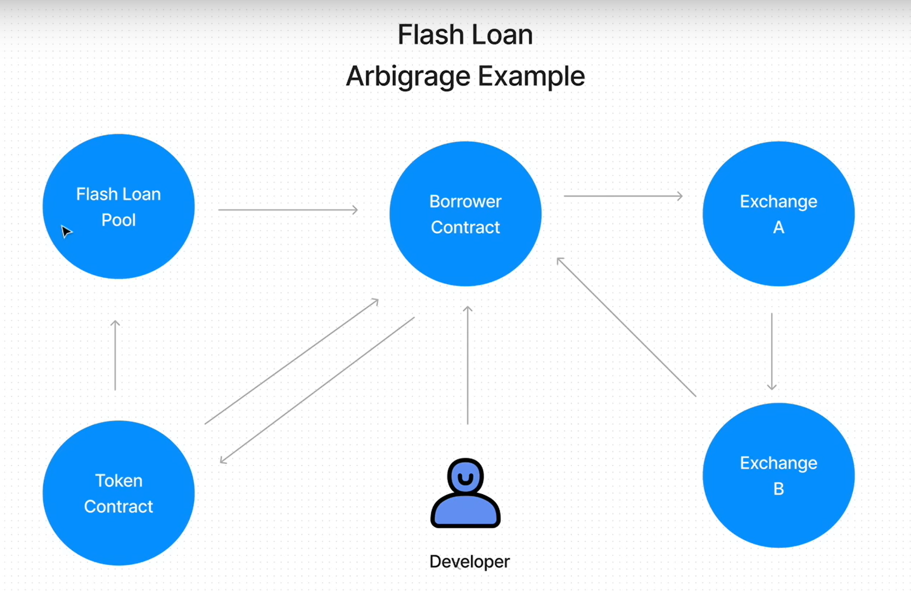

# RealEstate - Smart-Contract
##  Sample  "Solidity / Hardhat with Javascript" Project

This project demonstrates a basic Hardhat use case. It comes with a sample contract, a test for that contract, and a script that deploys that contract.

 
  * Seller lists property
  * Buyer deposits earnset
  * Appraisal
  * Inspection
  * Lender approves
  * Lender funds
  * Transfer Ownership
  * Seller gets paid 

  --------------------------------------------------------------------------------------

  Flash Loan - Arbitrage Exemple

  
  
  /-- Dapp University --/
  https://www.youtube.com/watch?v=eoQJ6nFZOcs&t=6705s

Try running some of the following tasks:

```shell
npx hardhat help
npx hardhat test
REPORT_GAS=true npx hardhat test
npx hardhat node
npx hardhat run scripts/deploy.js
```
## Smart_Contract_Solidity
